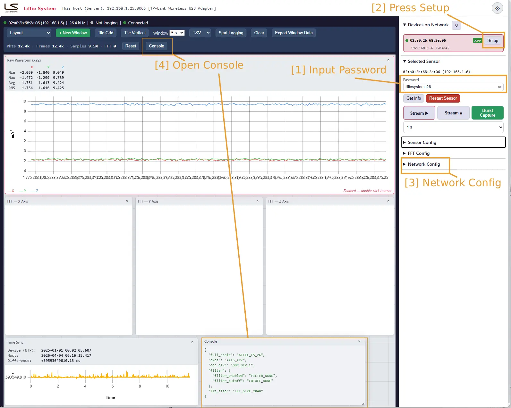
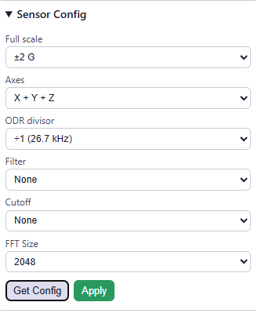

# Browser Viewer

[](LICENSE)

Real-time browser-based vibration sensor viewer for the [A2E-TRI Accelerometer](https://lilliesystems.com/products/a2e-tri/) from [Lillie Systems](https://lilliesystems.com).

Receives protobuf-framed acceleration data over TCP **or UDP**, displays live waveforms and FFT/PSD spectra (Q15 or **float32** precision, with a log-scale option), and provides sensor configuration via a web UI.

Protocol definitions: [lillie-protobuf](https://github.com/jacoblilsys/lillie-protobuf)


## Requirements

- Python 3.10+
- Packages listed in `requirements.txt`

## Quick Start

```bash
cd Utils/browser_viewer/backend

# Create virtual environment (first time only)


# For linux
python3 -m venv ~/venv-browser-viewer
source ~/venv-browser-viewer/bin/activate
pip install -r ../requirements.txt

#For Window CMD
python3 -m venv ~\venv-browser-viewer
~\venv-browser-viewer\Scripts\activate.bat
pip install -r ..\requirements.txt


# Run
uvicorn main:app --host 0.0.0.0 --port 8000

```

Then open `http://localhost:8000` in a browser.

## Configuration

All settings are via environment variables. Defaults are sensible for typical use.

| Variable     | Default  | Description                                                              |
|--------------|----------|--------------------------------------------------------------------------|
| `TCP_PORT`   | `8066`   | TCP port the backend listens on for sensor data                          |
| `UDP_PORT`   | *(= `TCP_PORT`)* | UDP port the backend listens on for sensor data. Defaults to `TCP_PORT` — the sensor sends UDP to the same `server_port` it uses for TCP. TCP and UDP share the port number without conflict. |
| `LOG_DIR`    | `./logs` | Directory where log files (TSV/HDF5) are written                         |
| `WS_FPS`     | `60`     | WebSocket broadcast rate in frames per second                            |
| `NETWORK_IF` | *(auto)* | Local IP of the network interface to use for sensor UDP/multicast commands. Auto-detected if not set. Set this if sensor API commands time out (e.g. `NETWORK_IF=192.168.0.200`). |
| `FIRMWARE_DIR` | *(auto)* | Folder(s) searched for `.sfb`/`.bin` firmware, `os.pathsep`-separated. Defaults to the production `Firmwares/` tree next to the viewer, then `browser_viewer/firmware/`. See [Firmware update](#firmware-update-tftp). |
| `TFTP_PORT`  | `69`     | TFTP port on the sensor's bootloader                                     |
| `TFTP_LOCAL_IP` | *(auto)* | Local IP to bind the TFTP client socket to. Only needed when the default route picks the wrong adapter. |

### Examples

**Linux / macOS:**
```bash
# Default settings (60 Hz broadcast, TCP port 8066)
uvicorn main:app --host 0.0.0.0 --port 8000

# Higher broadcast rate for smoother graphs
WS_FPS=120 uvicorn main:app --host 0.0.0.0 --port 8000

# Custom TCP port and log directory
TCP_PORT=9000 LOG_DIR=/data/logs uvicorn main:app --host 0.0.0.0 --port 8000

# Force a specific network interface (e.g. LAN instead of WiFi)
NETWORK_IF=192.168.0.200 uvicorn main:app --host 0.0.0.0 --port 8000

# Auto-reload during development
uvicorn main:app --reload --port 8000
```

**Windows (cmd):**
```cmd
:: Default settings
uvicorn main:app --host 0.0.0.0 --port 8000

:: Force a specific network interface (e.g. LAN instead of WiFi)
set NETWORK_IF=192.168.0.200 && uvicorn main:app --host 0.0.0.0 --port 8000

:: Multiple environment variables
set NETWORK_IF=192.168.0.200 && set WS_FPS=120 && uvicorn main:app --host 0.0.0.0 --port 8000
```

**Windows (PowerShell):**
```powershell
$env:NETWORK_IF="192.168.0.200"; uvicorn main:app --host 0.0.0.0 --port 8000
```

### Broadcast rate (`WS_FPS`)

The backend accumulates full-rate samples (e.g. 26.7 kHz) and sends a downsampled summary (min/max/last per axis) to the browser at `WS_FPS` frames per second.

| WS_FPS | Decimation at 26.7 kHz | WS bandwidth | Notes                        |
|--------|------------------------|--------------|------------------------------|
| 30     | ~887:1                 | ~6 KB/s      | Low CPU, coarser display     |
| 60     | ~443:1                 | ~12 KB/s     | Default, smooth for most use |
| 120    | ~222:1                 | ~24 KB/s     | Smoother, higher CPU         |

## Architecture

```
┌──────────┐  TCP/protobuf  ┌───────────────┐  asyncio.Queue  ┌───────────┐
│  Sensor  │ ──────────────►│NetworkReceiver│ ──────────────► │drain_queue│
└──────────┘   port 8066    └───────────────┘                 └─────┬─────┘
                                                                    │
                                                          ┌─────────┼─────────┐
                                                          ▼         ▼         ▼
                                                    Broadcaster  LogWriter  Status
                                                     (WS_FPS)   (TSV/HDF5) broadcast
                                                          │
                                                    WebSocket
                                                          │
                                                    ┌─────▼──────┐
                                                    │  Browser   │
                                                    │  (uPlot)   │
                                                    └────────────┘
```

- **NetworkReceiver** — TCP listener in a background thread. Frames are length-prefixed (4-byte big-endian uint32 + protobuf payload).
- **UDPReceiver** — UDP listener in a background thread (bound to `UDP_PORT`). Each datagram carries a 12-byte chunk header (`packet_id`, `chunk_idx`, `chunk_count`, `chunk_size`, `total_size`); chunks are reassembled by `(source_ip, packet_id)` into the same length-prefixed frame the TCP path produces, then fed to the identical decoder. Lost/timed-out packets are counted and surfaced as diagnostics. Runs alongside TCP — either stream (raw / FFT) can be TCP or UDP independently.
- **protobuf_decoder** — Decodes protobuf into `FrameData` (numpy arrays per axis) and `FFTFrameData`. FFT bins are decoded per-column from their `MetaData` dtype (`data_numpy_type`/`data_numpy_bytes`): Q15 signed int16, Q15 unsigned uint16 (vector modes), or IEEE-754 float32. Magnitudes are converted with the column's own `float_factor` and nothing else — pre-0x1033 sensors are re-normalised onto that scale once their firmware version is known (see [FFT amplitude scale](#fft-amplitude-scale-firmware--0x1033)).
- **Broadcaster** — Accumulates samples, emits min/max/last per axis at `WS_FPS` Hz via WebSocket. FFT spectra are throttled to 30 Hz. Supports pause/resume to stop sending data to browsers without affecting logging.
- **LogWriter / LogManager** — Full-rate logging to TSV or HDF5 (selectable in the UI).
- **MDNSScanner** — Discovers sensors on the network via `_nw-config._udp.local.` mDNS service.
- **sensor_api** — UDP API for sensor configuration (HMAC-MD5 authenticated).

## Browser UI

- **Topbar** — Company logo, app title, server IP:port, light/dark theme toggle
- **Chart toolbar** — New window, tile grid/vertical, log format, start/stop logging, clear, live stats (packets/frames/samples/FFT/UDP-lost), console toggle, **Monitor** toggle
- **Charts area** — Floating draggable/resizable windows with snap-to-grid (60px). Each chart window's titlebar has a **⚙ settings** button housing all per-window options — Y-axis scale (auto/fixed), log magnitude scale (FFT/PSD/spectrogram), and window length (raw). Create any combination of:
  - Raw Waveform (XYZ) — live acceleration traces
  - FFT (X/Y/Z) — frequency spectrum per axis, X-axis scaled by actual sample rate
  - PSD (X/Y/Z) — power spectral density per axis, `(m/s²)²/Hz`. Derived from the sensor's amplitude spectrum as a **one-sided, Hann-windowed density** (`S_k = a_k²/(2·ENBW·Δf)`, ENBW = 1.5 bins) — matching `scipy.signal.periodogram(x, fs, window='hann', scaling='density')`, so levels agree with an FFT computed directly from the raw samples. See [FFT amplitude scale](#fft-amplitude-scale-firmware--0x1033).
- **Sidebar** — Device list (auto-discovered via mDNS), selected sensor controls (incl. live CPU load, firmware debug string, and runtime FFT ▶/■), sensor config (full scale, axes, ODR, filter, FFT size, and Q15/float32 FFT precision), network config (incl. per-stream TCP/UDP transport and NTP mode: poll/listen/disabled)
- **Floating console** — Toggleable JSON output window for sensor API responses
- **Traffic Monitor** (`Monitor` toggle) — a floating panel showing per-stream health: RAW and FFT **received vs missing** frames (missing inferred from `sequence_number` gaps, so it works over both TCP and UDP), loss %, rates, and transport; plus UDP link stats (datagrams, packets reassembled, lost packets/chunks). **Enabling it pauses chart streaming to the browser** (the backend keeps receiving, counting, and logging) to minimize load — ideal for long logging runs where you only want to watch for dropouts. Logging works normally in this mode. The panel's **Reset** zeroes all counters (base + per-stream + UDP).

### Window management

- **Tile Grid** — Auto-arranges all windows into an even grid
- **Tile Vertical** — Stacks all windows vertically at full width
- **Snap-to-grid** — Windows snap to a 60px grid on drag/resize release
- **Bounds clamping** — Windows cannot be dragged or resized beyond the charts area
- **Per-window settings (⚙)** — Each window has its own settings, opened from the gear in its titlebar:
  - **Y-axis scale** (raw/FFT/PSD) — *Auto* (fits the data every frame, default) or *Fixed* (a min/max you set, so the trace stops jumping). "Fit to data" seeds the min/max from what's currently shown. Fixed values are in the plotted units and respect the log toggle.
  - **Log magnitude scale** (FFT/PSD/spectrogram) — reveals small signals far below the peaks (needed to see float32's dynamic range).
  - **Window length** (raw windows) — how many seconds of waveform to show on the X-axis, per window. (This replaced the old global toolbar selector.)

### Stream control

- **Stream Start/Stop** — Pauses/resumes data broadcast to the browser. The backend continues receiving and logging data regardless. No sensor selection required.
- **FFT ▶/■** (in Selected Sensor) — Runtime command to the sensor to start/stop FFT streaming *now* (`Command.stream_fft`), no reboot. This is distinct from **Network Config → FFT Stream**, which is the persistent boot default applied on reboot. Requires sensor selection.

## Firmware update (TFTP)

**Selected Sensor → Update Firmware…** flashes a new application image onto the
selected sensor and verifies it, in one modal.

The bootloader does **not** fetch firmware — in bootloader mode the sensor runs a
TFTP *server*, and the PC pushes the file into it (WRQ). The modal drives six steps:

1. **Prepare** — read the running firmware version (`get_sensor_info`), stop the
   sensor's raw + FFT streams and pause the viewer's broadcast. Nothing may be
   streaming while flash is written.
2. **Reboot** — `Command.reset_device`; the sensor restarts into its bootloader.
   **Firmware up to and including `0x102F` is exempt**: it acknowledges the reset
   and keeps running (firmware bug), so for those the step turns into "Power-cycle the
   sensor" — the modal shows a highlighted instruction to unplug and replug it,
   waits (≤ 5 min) for the sensor to drop off the network and reappear in its
   bootloader, then carries on by itself. No reset is sent to those units at all.
   The version list is only a shortcut, not the safety net: on **any** firmware,
   if the reset is acknowledged and the application is still answering 25 s later,
   the updater concludes the reset did nothing and switches to the same
   power-cycle prompt rather than uploading into a sensor that isn't listening.
3. **Bootloader** — wait (≤ 25 s) for the mDNS record to report `mode=boot`. If it
   never appears the upload is attempted anyway — the bootloader only waits ~42 s
   before starting the application, so the window must not be wasted.
4. **Upload** — TFTP push of the `.sfb`, with a live byte/percent progress bar.
5. **Restart** — poll `get_sensor_info` until it reports a **non-zero**
   `firmware_version`. The bootloader answers config requests too, but reports
   `0x0` — the application version only exists once the application is running, so
   a non-zero version is the proof the image installed and the sensor rebooted.
   (An mDNS record is not proof: it can be a stale one served from the cache.)
   Once the bootloader has been answering for 5 s, `boot_now` is sent to skip its
   ~42 s countdown — after the upload only, never during the window the upload
   needs. Resent up to 3 times, 15 s apart, in case the datagram is lost; if the
   bootloader refuses it, the countdown is simply allowed to run.
6. **Verify** — compare the reported version with the one in the file name
   (`…_APP_1033.sfb` → `0x1033`). Mismatch fails the update.

Failures report *cause* and *what to do* rather than a raw exception, and the log
of every step stays on screen.

**Cancel** appears while the job is still at prepare/reboot/bootloader — nothing
has reached the sensor yet, so backing out is free (useful when a power cycle
turns out to be impractical). It is refused from the upload onwards: interrupting
a flash write is how a sensor ends up with no working firmware.

**Auto fast-boot is forced off for the whole run** and restored afterwards. A
`boot_now` sent while the sensor waits in its bootloader jumps it into the
application and the upload has nowhere to land; `/api/sensor/boot` returns **409**
during an update so another browser tab cannot break the flash either.

Firmware files come from the folders in `FIRMWARE_DIR` (or, unset, the production
`Firmwares/` tree next to the viewer), plus anything sent with **Upload file…**,
which stores it in `backend/fw_uploads/`. Files whose names look like combined
SBSFU images (bootloader + application) are flagged — those are flashed over
SWD/ST-Link, not pushed into a running bootloader. Re-flashing the same version
and downgrades are allowed but warned about.

> ⚠ Do not unplug the LAN cable or cut PoE power during an update. The whole run
> takes about a minute.

## Transport (TCP / UDP)

Each stream — raw samples and FFT — can be delivered over TCP or UDP, set independently in **Network Config** (`Raw Transport`, `FFT Transport`). TCP is the legacy reliable stream; UDP sends the same frames as 12-byte-header chunks that the backend reassembles.

- The setting is **persisted on the sensor and applied on its next reboot** — power-cycle the sensor after Apply.
- The backend always listens on both TCP and UDP (`UDP_PORT`, default = `TCP_PORT`), so no host restart is needed when switching.
- The **UDP-lost** counter in the toolbar shows chunks dropped during reassembly (stays 0 on TCP). Non-zero values indicate packet loss on the link.

## FFT precision (Q15 / Float32)

In **Sensor Config**, `FFT Precision` selects the on-device FFT numeric format (read with Get Config, written with Apply, alongside the other sensor settings):

- **Q15** — int16, 2 bytes/bin, ~90 dB dynamic range (legacy default).
- **Float32** — IEEE-754, 4 bytes/bin, ~144 dB. Reveals spectral content near the sensor's ~75 µg/√Hz noise floor that Q15 rounds to zero. Roughly doubles FFT bandwidth.

The change takes effect immediately (the sensor drops one FFT frame during the switch — no reboot). The backend detects the format per-column from frame metadata, so no host setting is required. Turn on **Log magnitude scale** in a window's **⚙ settings** to actually see float32's extra dynamic range.

Both precisions now read the **same physical value** — see below.

## FFT amplitude scale (firmware ≥ 0x1033)

FFT magnitudes are an **amplitude spectrum**: a tone of amplitude `A` reads `A` at its bin, and a constant offset `A` reads `A` in bin 0 — for every `fft_size` and in either precision. The conversion to SI is exactly what the frame metadata declares, with no host-side correction factor:

```
value_SI = raw × post_unit_scaling.float_factor × 10^si_unit_scaling_base10_exp
```

`float_factor` is read per column, per frame, so a future firmware normalisation change is absorbed there with no host change.

PSD is derived from that amplitude with the Hann window's ENBW of 1.5 bins:

```
Δf  = sample_rate / fft_size
PSD = amplitude² / (2 × 1.5 × Δf)        → (unit)²/Hz
```

which is identically the one-sided Hann-windowed density periodogram, so levels agree with `scipy.signal.periodogram(x, fs, window='hann', scaling='density')` computed from the raw samples. The test suite checks both the amplitude scale (against the firmware's reference implementation, N = 256…2048) and the PSD against that periodogram.

### Older firmware is compensated — press Get Info first

Firmware 0x1030–0x1032 shipped un-normalised magnitudes, and differently per transport: **Q15 was 8× low** (an implicit `1/(2N)` from the CMSIS Q15 pipeline), **float32 was `fft_size/4`× high** (never normalised at all — changing FFT size alone scaled every value), and neither halved bin 0.

Nothing on the wire distinguishes the two eras: 0x1033 changed no field, dtype or metadata value, only the numbers. The viewer therefore keys off the firmware version, which it learns from **Get Info**:

- **Before** Get Info, or on 0x1033+, magnitudes are taken as normalised — the documented behaviour.
- **After** Get Info on a sensor reporting < 0x1033, its bins are re-normalised onto the 0x1033 scale (Q15 ×8, float32 ×4/N, and half that at DC) from the next frame on, so plots, PSD and captures are all in one convention. The **FFT scale** chip in *Selected Sensor* turns amber to say so, and the console logs it.

Consequences worth knowing:

- Spectra recorded from an old sensor **before** the first Get Info are on the raw firmware scale. HDF5 captures record which convention they hold (`/fft` attrs `magnitude_convention`, `legacy_scaling`).
- Comparing captures across the 0x1033 boundary: int16 readings shift **8× up**, float32 **`fft_size/4`× down**.
- Firmware < 0x1033 also emitted **duplicate FFT frames at `fft_size` 256** (byte-identical, distinct `sequence_number`) — roughly half the columns of a spectrogram recorded at that size. Fixed on the sensor in 0x1033; the viewer's spectrogram and HDF5 `mag_*`/`psd_*` rows are in frame arrival order, which stays a correct time base at every size.

## DC removal (software high-pass, firmware ≥ 0x1032)

**Sensor Config → DC Removal** enables a software first-order high-pass that strips the DC / gravity offset from the samples. It runs on the sensor downstream of the FIFO and the decimator, per axis, and is **independent of the hardware `Filter` selector** — LPF2 anti-aliasing and DC removal can both be active, which is the point of the feature. Read with Get Config, written with Apply.

| Cutoff | −3 dB | Settling to <1 % |
|---|---:|---:|
| 0.1 Hz | 0.1 Hz | 7.3 s |
| 0.5 Hz | 0.5 Hz | 1.5 s |
| 1 Hz | 1 Hz | 730 ms |
| 2 Hz | 2 Hz | 370 ms |
| 5 Hz | 5 Hz | 150 ms |
| 10 Hz | 10 Hz | 75 ms |

- **Single pole, −6 dB/octave** — at a 1 Hz corner a 2 Hz component is still ~3 dB down, so pick a corner well below the lowest frequency of interest.
- Cutoffs are **absolute Hz** and do not move with the ODR divisor (unlike the hardware filter's ODR/N corners).
- Affects **both the raw and FFT streams**. **FFT bin 0 collapses** to ~0 while DC removal is on; it reports |DC| when off, so anything using bin 0 as a DC/tilt indicator changes meaning.
- With **vector axis modes** the filter is applied per axis *before* the magnitude, giving a rectified AC magnitude — single-axis vibration then appears at double frequency. Not recommended together with the FFT stream.
- The sensor **auto-bypasses** it during a calibration run and while the hardware `High-pass` or `Slope filter` is selected (the stored value is kept; the UI flags this next to the dropdown).
- Applied without a reboot, but like every sensor setting it re-inits sampling: expect a ~10 ms gap, which the traffic monitor counts as **missing** frames.
- Firmware ≤ 0x1031 has no such field — the viewer then reads back `DC_REMOVAL_OFF` and the setting silently has no effect.

Enable and cutoff share a single wire enum, so choosing **Off** does not remember the cutoff. The viewer caches the last non-Off choice per sensor in `localStorage` and offers a *restore* link under the dropdown.

## Logging formats

Toggle between formats in the chart toolbar dropdown (while not actively logging).

- **TSV** (`.log`) — Tab-separated values. Human-readable, open in any text editor or spreadsheet. Includes comment header with device ID, sample rate, units, and the last-known sensor settings.
- **HDF5** (`.h5`) — Chunked + gzip compressed (float32). Read with Python (`h5py`, `scipy`), MATLAB, R, Julia. Includes metadata attributes and FFT data.

Sensor settings are not carried in the packet header, so both formats stamp the **last config read or written through the viewer** for that device (`dc_removal`, `odr_div`, `full_scale`, `axes`, `filter_enabled`, `filter_cutoff`, `fft_size`, `fft_precision`) — without it a saved capture would not record whether the signal was high-passed, or at what corner. Press **Get Config** once before logging if the viewer has not talked to the sensor yet; a file already open keeps the values it was opened with.

### HDF5 file structure

```
/ (root)
├── attrs: device_id, stream_uid, sample_rate_hz, created_at,
│          dc_removal, odr_div, full_scale, axes, filter_enabled,
│          filter_cutoff, fft_size, fft_precision   — last-known sensor config
├── data/
│   ├── accel_x     (N,)        float32  — raw samples, attrs: unit
│   ├── accel_y     (N,)        float32
│   └── accel_z     (N,)        float32
└── fft/                                  — present when FFT streaming is active
    ├── attrs: fft_bins, fft_size, unit, magnitude_convention,
    │          psd_definition, legacy_scaling   — which amplitude scale mag_*
    │          holds, and whether it was re-normalised from pre-0x1033 firmware
    ├── freq_hz     (bins,)     float32  — frequency axis
    ├── mag_x       (M, bins)   float32  — amplitude spectra (M frames × bins)
    ├── mag_y       (M, bins)   float32
    ├── mag_z       (M, bins)   float32
    ├── psd_x       (M, bins)   float32  — power spectral density
    ├── psd_y       (M, bins)   float32
    └── psd_z       (M, bins)   float32
```

### 3D FFT viewer

A standalone tool for visualizing FFT data from HDF5 log files:

```bash
python view_fft3d.py logs/yourfile.h5 --axis x
```

Generates a 3D surface plot and a 2D spectrogram heatmap (saved as PNG). Options:

| Option | Description |
|--------|-------------|
| `--axis x\|y\|z` | Which axis to plot (default: x) |
| `--psd` | Plot PSD instead of magnitude |
| `--log` | Log scale |
| `--max-frames 500` | Limit frames for performance |
| `--colormap plasma` | Any matplotlib colormap |

## REST API

| Method | Endpoint                | Description                          |
|--------|------------------------|--------------------------------------|
| GET    | `/api/status`          | Connection, logging, streaming state |
| GET    | `/api/devices`         | Discovered sensors (mDNS)           |
| GET    | `/api/host`            | Server LAN IP and TCP port          |
| POST   | `/api/stream/start`    | Resume data broadcast to browsers   |
| POST   | `/api/stream/stop`     | Pause data broadcast to browsers    |
| POST   | `/api/logging/start`   | Start logging to file               |
| POST   | `/api/logging/stop`    | Stop logging                        |
| GET/POST | `/api/logging/format` | Get/set log format (tsv/hdf5)      |
| POST   | `/api/stream/raw/start` | Tell a sensor to start raw data now |
| POST   | `/api/stream/raw/stop`  | Tell a sensor to stop raw data now  |
| POST   | `/api/stats/reset`     | Reset packet/frame/FFT counters     |
| POST   | `/api/sensor/info`     | Query sensor info                   |
| POST   | `/api/sensor/password` | Change the sensor application password (`new_password`, 1–63 bytes) |
| POST   | `/api/sensor/config`   | Get sensor config                   |
| POST   | `/api/sensor/config/set` | Set sensor config                 |
| POST   | `/api/network/config`  | Get network config                  |
| POST   | `/api/network/config/set` | Set network config               |
| POST   | `/api/stream/fft/start` | Start FFT streaming on sensor      |
| POST   | `/api/stream/fft/stop`  | Stop FFT streaming on sensor       |
| POST   | `/api/sensor/reset`    | Reset the sensor                    |
| POST   | `/api/sensor/boot`     | Fast-boot a sensor out of its bootloader (409 during a firmware update) |
| GET    | `/api/fw/list`         | Firmware files the server can offer, and the folders searched |
| POST   | `/api/fw/upload`       | Upload a `.sfb` (raw body, `?name=…`) to the server's `fw_uploads/` |
| POST   | `/api/fw/start`        | Start a firmware update on one sensor |
| GET    | `/api/fw/status`       | Live progress of the running/last firmware update |
| POST   | `/api/fw/cancel`       | Abandon a job that hasn't sent firmware yet (409 from the upload onwards) |
| POST   | `/api/ntp/check`       | Test if an NTP server is reachable  |

## NTP Server Setup

The sensor needs an NTP server for time synchronization. Your machine can serve NTP to the sensor. The viewer's "Test NTP" button (in Network Config) checks if port 123 is reachable.

### NTP Mode (firmware ≥ 0x1030)

Network Config has an **NTP Mode** selector (applied immediately, no reboot):

- **Poll** *(default)* — the sensor queries the configured NTP Server (unicast SNTP client). This is the classic behavior.
- **Listen (broadcast)** — the sensor never sends outbound NTP; it only listens for broadcast/multicast SNTP on the local segment. Use this on isolated LANs or **link-local (169.254.x.x)** networks where there's no route to an internet NTP server. The NTP Server IP is ignored (the field is greyed out). To provide a broadcast source, run `chronyd` in broadcast mode on a host on the same L2 segment (e.g. `broadcast 64 192.168.0.255` in `chrony.conf`); first sync can take a couple of minutes.
- **Disabled** — no time synchronization.

### Linux (chrony)

```bash
# Install
sudo apt install -y chrony

# Allow your local subnet to query NTP
echo "allow 192.168.0.0/24" | sudo tee -a /etc/chrony/chrony.conf

# Fix sandbox issue — chrony's -F 1 flag prevents binding to port 123
sudo mkdir -p /etc/systemd/system/chrony.service.d
echo -e "[Service]\nExecStart=\nExecStart=/usr/sbin/chronyd" | sudo tee /etc/systemd/system/chrony.service.d/override.conf
sudo systemctl daemon-reload
sudo systemctl restart chrony

# Verify port 123 is open
ss -uln | grep 123
# Should show: UNCONN 0 0 0.0.0.0:123 0.0.0.0:*

# Verify sync status
chronyc tracking
```

### Windows

Windows has a built-in NTP server (w32time):

```cmd
# Run as Administrator
w32tm /config /reliable:YES
net stop w32time
# wait for the service to stop...
net start w32time

# Verify
w32tm /query /status
```

Or install a dedicated NTP server like [Meinberg NTP](https://www.meinbergglobal.com/english/sw/ntp.htm).

### macOS

macOS can serve NTP via `ntpd`:

```bash
sudo sntp -sS pool.ntp.org   # sync local clock first
# For serving: edit /etc/ntp.conf and restart ntpd
```

### Verify from the viewer

1. Set the NTP Server IP in Network Config to your machine's IP
2. Click "Test" next to the field — should show "OK (stratum N, offset ±X ms)"
3. The Setup modal also auto-checks NTP when opened

## Tips

If the viewer is on a different subnet than the sensor, you can add an IP address to your network adapter:

**Windows** (run as admin):
```
netsh interface ip add address "Ethernet" 192.168.0.200 255.255.255.0
```

**Linux**:
```bash
sudo ip addr add 192.168.0.200/24 dev eth0
```

Or use the `setup_sensor.py` rescue tool for link-local sensors — see [setup_sensor.py](setup_sensor.py).


### Quick Guide
After opening the browser, start by inputting the default password: lilliesystems26 in the password field. 



If the device shows up in the Devices on Network then click the setup button. 


Clicking Apply Setup will configure the sensor with the host Server Ip so the sensor can start streaming data and communicate. 

DHCP is enabled by default in the sensor. If no DHCP is available, it will fall back to a link local address. In this case your network card must be configured for a link local subnet in order for it to setup a static IP. 

Expanding the Network Config dropdown and pressing Get Config will receive the network settings. Make sure the Server IP is correcly configured. 


Expanding the Sensor Config dropdown shows the different configurations such as full scale range, Output Data Rate (ODR), filter and FFT selections, and — on firmware 0x1032 and later — the software [DC Removal](#dc-removal-software-high-pass-firmware--0x1032) high-pass. 


## Trouble shooting
