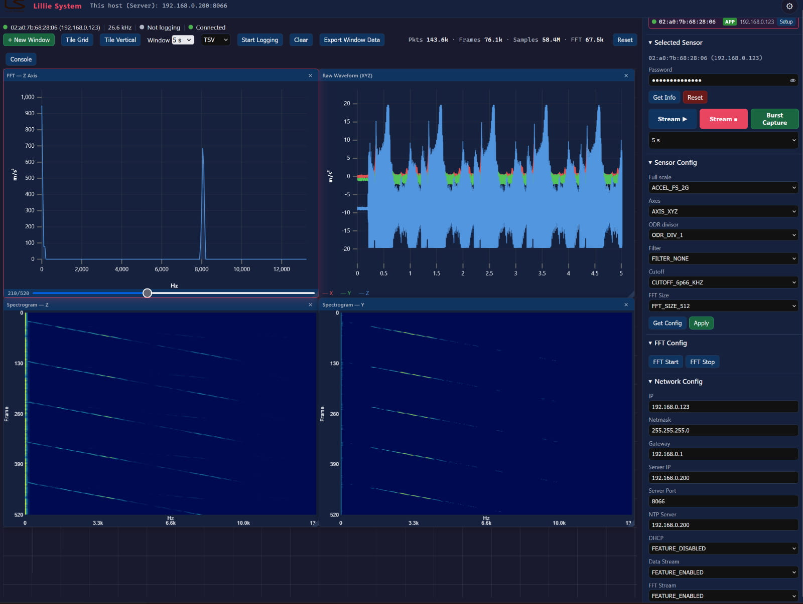
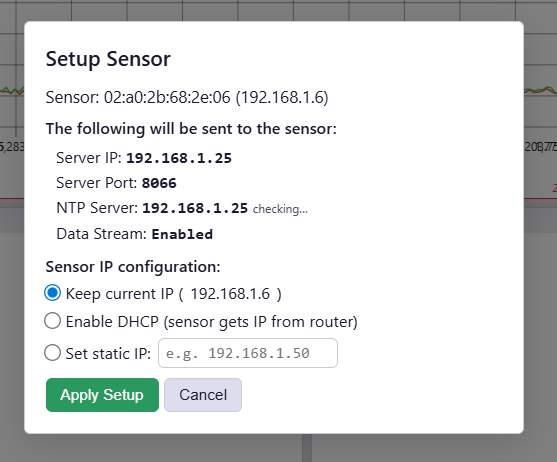
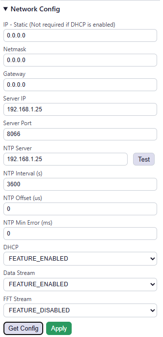

# Browser Viewer

[](LICENSE)

Real-time browser-based vibration sensor viewer for the [A2E-TRI Accelerometer](https://lilliesystems.com/products/a2e-tri/) from [Lillie Systems](https://lilliesystems.com).

Receives protobuf-framed acceleration data over TCP **or UDP**, displays live waveforms and FFT/PSD spectra (Q15 or **float32** precision, with a log-scale option), and provides sensor configuration via a web UI.

Protocol definitions: [lillie-protobuf](https://github.com/jacoblilsys/lillie-protobuf)



## Requirements

- Python 3.10+
- Packages listed in `requirements.txt`

## Quick Start

```bash
cd Utils/browser_viewer/backend

# Create virtual environment (first time only)


# For linux
python3 -m venv ~/venv-browser-viewer
source ~/venv-browser-viewer/bin/activate
pip install -r ../requirements.txt

#For Window CMD
python3 -m venv ~\venv-browser-viewer
~\venv-browser-viewer\Scripts\activate.bat
pip install -r ..\requirements.txt


# Run
uvicorn main:app --host 0.0.0.0 --port 8000

```

Then open `http://localhost:8000` in a browser.

## Configuration

All settings are via environment variables. Defaults are sensible for typical use.

| Variable     | Default  | Description                                                              |
|--------------|----------|--------------------------------------------------------------------------|
| `TCP_PORT`   | `8066`   | TCP port the backend listens on for sensor data                          |
| `UDP_PORT`   | *(= `TCP_PORT`)* | UDP port the backend listens on for sensor data. Defaults to `TCP_PORT` — the sensor sends UDP to the same `server_port` it uses for TCP. TCP and UDP share the port number without conflict. |
| `LOG_DIR`    | `./logs` | Directory where log files (TSV/HDF5) are written                         |
| `WS_FPS`     | `60`     | WebSocket broadcast rate in frames per second                            |
| `NETWORK_IF` | *(auto)* | Local IP of the network interface to use for sensor UDP/multicast commands. Auto-detected if not set. Set this if sensor API commands time out (e.g. `NETWORK_IF=192.168.0.200`). |

### Examples

**Linux / macOS:**
```bash
# Default settings (60 Hz broadcast, TCP port 8066)
uvicorn main:app --host 0.0.0.0 --port 8000

# Higher broadcast rate for smoother graphs
WS_FPS=120 uvicorn main:app --host 0.0.0.0 --port 8000

# Custom TCP port and log directory
TCP_PORT=9000 LOG_DIR=/data/logs uvicorn main:app --host 0.0.0.0 --port 8000

# Force a specific network interface (e.g. LAN instead of WiFi)
NETWORK_IF=192.168.0.200 uvicorn main:app --host 0.0.0.0 --port 8000

# Auto-reload during development
uvicorn main:app --reload --port 8000
```

**Windows (cmd):**
```cmd
:: Default settings
uvicorn main:app --host 0.0.0.0 --port 8000

:: Force a specific network interface (e.g. LAN instead of WiFi)
set NETWORK_IF=192.168.0.200 && uvicorn main:app --host 0.0.0.0 --port 8000

:: Multiple environment variables
set NETWORK_IF=192.168.0.200 && set WS_FPS=120 && uvicorn main:app --host 0.0.0.0 --port 8000
```

**Windows (PowerShell):**
```powershell
$env:NETWORK_IF="192.168.0.200"; uvicorn main:app --host 0.0.0.0 --port 8000
```

### Broadcast rate (`WS_FPS`)

The backend accumulates full-rate samples (e.g. 26.7 kHz) and sends a downsampled summary (min/max/last per axis) to the browser at `WS_FPS` frames per second.

| WS_FPS | Decimation at 26.7 kHz | WS bandwidth | Notes                        |
|--------|------------------------|--------------|------------------------------|
| 30     | ~887:1                 | ~6 KB/s      | Low CPU, coarser display     |
| 60     | ~443:1                 | ~12 KB/s     | Default, smooth for most use |
| 120    | ~222:1                 | ~24 KB/s     | Smoother, higher CPU         |

## Architecture

```
┌──────────┐  TCP/protobuf  ┌───────────────┐  asyncio.Queue  ┌───────────┐
│  Sensor  │ ──────────────►│NetworkReceiver│ ──────────────► │drain_queue│
└──────────┘   port 8066    └───────────────┘                 └─────┬─────┘
                                                                    │
                                                          ┌─────────┼─────────┐
                                                          ▼         ▼         ▼
                                                    Broadcaster  LogWriter  Status
                                                     (WS_FPS)   (TSV/HDF5) broadcast
                                                          │
                                                    WebSocket
                                                          │
                                                    ┌─────▼──────┐
                                                    │  Browser   │
                                                    │  (uPlot)   │
                                                    └────────────┘
```

- **NetworkReceiver** — TCP listener in a background thread. Frames are length-prefixed (4-byte big-endian uint32 + protobuf payload).
- **UDPReceiver** — UDP listener in a background thread (bound to `UDP_PORT`). Each datagram carries a 12-byte chunk header (`packet_id`, `chunk_idx`, `chunk_count`, `chunk_size`, `total_size`); chunks are reassembled by `(source_ip, packet_id)` into the same length-prefixed frame the TCP path produces, then fed to the identical decoder. Lost/timed-out packets are counted and surfaced as diagnostics. Runs alongside TCP — either stream (raw / FFT) can be TCP or UDP independently.
- **protobuf_decoder** — Decodes protobuf into `FrameData` (numpy arrays per axis) and `FFTFrameData`. FFT bins are decoded per-column from their `MetaData` dtype (`data_numpy_type`/`data_numpy_bytes`): Q15 signed int16, Q15 unsigned uint16 (vector modes), or IEEE-754 float32.
- **Broadcaster** — Accumulates samples, emits min/max/last per axis at `WS_FPS` Hz via WebSocket. FFT spectra are throttled to 30 Hz. Supports pause/resume to stop sending data to browsers without affecting logging.
- **LogWriter / LogManager** — Full-rate logging to TSV or HDF5 (selectable in the UI).
- **MDNSScanner** — Discovers sensors on the network via `_nw-config._udp.local.` mDNS service.
- **sensor_api** — UDP API for sensor configuration (HMAC-MD5 authenticated).

## Browser UI

- **Topbar** — Company logo, app title, server IP:port, light/dark theme toggle
- **Chart toolbar** — New window, tile grid/vertical, log format, start/stop logging, clear, live stats (packets/frames/samples/FFT/UDP-lost), console toggle, **Monitor** toggle
- **Charts area** — Floating draggable/resizable windows with snap-to-grid (60px). Each chart window's titlebar has a **⚙ settings** button housing all per-window options — Y-axis scale (auto/fixed), log magnitude scale (FFT/PSD/spectrogram), and window length (raw). Create any combination of:
  - Raw Waveform (XYZ) — live acceleration traces
  - FFT (X/Y/Z) — frequency spectrum per axis, X-axis scaled by actual sample rate
  - PSD (X/Y/Z) — power spectral density per axis, `(m/s²)²/Hz`. Computed as a **one-sided, Hann-windowed, density-scaled periodogram** (`S_k = 2·|X_k|²/(fs·Σw²)`, factor 1 at DC) — matching `scipy.signal.periodogram(x, fs, window='hann', scaling='density')`, so levels agree with an FFT computed directly from the raw samples.
- **Sidebar** — Device list (auto-discovered via mDNS), selected sensor controls (incl. live CPU load, firmware debug string, and runtime FFT ▶/■), sensor config (full scale, axes, ODR, filter, FFT size, and Q15/float32 FFT precision), network config (incl. per-stream TCP/UDP transport)
- **Floating console** — Toggleable JSON output window for sensor API responses
- **Traffic Monitor** (`Monitor` toggle) — a floating panel showing per-stream health: RAW and FFT **received vs missing** frames (missing inferred from `sequence_number` gaps, so it works over both TCP and UDP), loss %, rates, and transport; plus UDP link stats (datagrams, packets reassembled, lost packets/chunks). **Enabling it pauses chart streaming to the browser** (the backend keeps receiving, counting, and logging) to minimize load — ideal for long logging runs where you only want to watch for dropouts. Logging works normally in this mode. The panel's **Reset** zeroes all counters (base + per-stream + UDP).

### Window management

- **Tile Grid** — Auto-arranges all windows into an even grid
- **Tile Vertical** — Stacks all windows vertically at full width
- **Snap-to-grid** — Windows snap to a 60px grid on drag/resize release
- **Bounds clamping** — Windows cannot be dragged or resized beyond the charts area
- **Per-window settings (⚙)** — Each window has its own settings, opened from the gear in its titlebar:
  - **Y-axis scale** (raw/FFT/PSD) — *Auto* (fits the data every frame, default) or *Fixed* (a min/max you set, so the trace stops jumping). "Fit to data" seeds the min/max from what's currently shown. Fixed values are in the plotted units and respect the log toggle.
  - **Log magnitude scale** (FFT/PSD/spectrogram) — reveals small signals far below the peaks (needed to see float32's dynamic range).
  - **Window length** (raw windows) — how many seconds of waveform to show on the X-axis, per window. (This replaced the old global toolbar selector.)

### Stream control

- **Stream Start/Stop** — Pauses/resumes data broadcast to the browser. The backend continues receiving and logging data regardless. No sensor selection required.
- **FFT ▶/■** (in Selected Sensor) — Runtime command to the sensor to start/stop FFT streaming *now* (`Command.stream_fft`), no reboot. This is distinct from **Network Config → FFT Stream**, which is the persistent boot default applied on reboot. Requires sensor selection.

## Transport (TCP / UDP)

Each stream — raw samples and FFT — can be delivered over TCP or UDP, set independently in **Network Config** (`Raw Transport`, `FFT Transport`). TCP is the legacy reliable stream; UDP sends the same frames as 12-byte-header chunks that the backend reassembles.

- The setting is **persisted on the sensor and applied on its next reboot** — power-cycle the sensor after Apply.
- The backend always listens on both TCP and UDP (`UDP_PORT`, default = `TCP_PORT`), so no host restart is needed when switching.
- The **UDP-lost** counter in the toolbar shows chunks dropped during reassembly (stays 0 on TCP). Non-zero values indicate packet loss on the link.

## FFT precision (Q15 / Float32)

In **Sensor Config**, `FFT Precision` selects the on-device FFT numeric format (read with Get Config, written with Apply, alongside the other sensor settings):

- **Q15** — int16, 2 bytes/bin, ~90 dB dynamic range (legacy default).
- **Float32** — IEEE-754, 4 bytes/bin, ~144 dB. Reveals spectral content near the sensor's ~75 µg/√Hz noise floor that Q15 rounds to zero. Roughly doubles FFT bandwidth.

The change takes effect immediately (the sensor drops one FFT frame during the switch — no reboot). The backend detects the format per-column from frame metadata, so no host setting is required. Turn on **Log magnitude scale** in a window's **⚙ settings** to actually see float32's extra dynamic range.

## Logging formats

Toggle between formats in the chart toolbar dropdown (while not actively logging).

- **TSV** (`.log`) — Tab-separated values. Human-readable, open in any text editor or spreadsheet. Includes comment header with device ID, sample rate, and units.
- **HDF5** (`.h5`) — Chunked + gzip compressed (float32). Read with Python (`h5py`, `scipy`), MATLAB, R, Julia. Includes metadata attributes and FFT data.

### HDF5 file structure

```
/ (root)
├── attrs: device_id, stream_uid, sample_rate_hz, created_at
├── data/
│   ├── accel_x     (N,)        float32  — raw samples, attrs: unit
│   ├── accel_y     (N,)        float32
│   └── accel_z     (N,)        float32
└── fft/                                  — present when FFT streaming is active
    ├── attrs: fft_bins, fft_size, unit
    ├── freq_hz     (bins,)     float32  — frequency axis
    ├── mag_x       (M, bins)   float32  — magnitude spectra (M frames × bins)
    ├── mag_y       (M, bins)   float32
    ├── mag_z       (M, bins)   float32
    ├── psd_x       (M, bins)   float32  — power spectral density
    ├── psd_y       (M, bins)   float32
    └── psd_z       (M, bins)   float32
```

### 3D FFT viewer

A standalone tool for visualizing FFT data from HDF5 log files:

```bash
python view_fft3d.py logs/yourfile.h5 --axis x
```

Generates a 3D surface plot and a 2D spectrogram heatmap (saved as PNG). Options:

| Option | Description |
|--------|-------------|
| `--axis x\|y\|z` | Which axis to plot (default: x) |
| `--psd` | Plot PSD instead of magnitude |
| `--log` | Log scale |
| `--max-frames 500` | Limit frames for performance |
| `--colormap plasma` | Any matplotlib colormap |

## REST API

| Method | Endpoint                | Description                          |
|--------|------------------------|--------------------------------------|
| GET    | `/api/status`          | Connection, logging, streaming state |
| GET    | `/api/devices`         | Discovered sensors (mDNS)           |
| GET    | `/api/host`            | Server LAN IP and TCP port          |
| POST   | `/api/stream/start`    | Resume data broadcast to browsers   |
| POST   | `/api/stream/stop`     | Pause data broadcast to browsers    |
| POST   | `/api/logging/start`   | Start logging to file               |
| POST   | `/api/logging/stop`    | Stop logging                        |
| GET/POST | `/api/logging/format` | Get/set log format (tsv/hdf5)      |
| POST   | `/api/stats/reset`     | Reset packet/frame/FFT counters     |
| POST   | `/api/sensor/info`     | Query sensor info                   |
| POST   | `/api/sensor/config`   | Get sensor config                   |
| POST   | `/api/sensor/config/set` | Set sensor config                 |
| POST   | `/api/network/config`  | Get network config                  |
| POST   | `/api/network/config/set` | Set network config               |
| POST   | `/api/stream/fft/start` | Start FFT streaming on sensor      |
| POST   | `/api/stream/fft/stop`  | Stop FFT streaming on sensor       |
| POST   | `/api/sensor/reset`    | Reset the sensor                    |
| POST   | `/api/ntp/check`       | Test if an NTP server is reachable  |

## NTP Server Setup

The sensor needs an NTP server for time synchronization. Your machine can serve NTP to the sensor. The viewer's "Test NTP" button (in Network Config) checks if port 123 is reachable.

### Linux (chrony)

```bash
# Install
sudo apt install -y chrony

# Allow your local subnet to query NTP
echo "allow 192.168.0.0/24" | sudo tee -a /etc/chrony/chrony.conf

# Fix sandbox issue — chrony's -F 1 flag prevents binding to port 123
sudo mkdir -p /etc/systemd/system/chrony.service.d
echo -e "[Service]\nExecStart=\nExecStart=/usr/sbin/chronyd" | sudo tee /etc/systemd/system/chrony.service.d/override.conf
sudo systemctl daemon-reload
sudo systemctl restart chrony

# Verify port 123 is open
ss -uln | grep 123
# Should show: UNCONN 0 0 0.0.0.0:123 0.0.0.0:*

# Verify sync status
chronyc tracking
```

### Windows

Windows has a built-in NTP server (w32time):

```cmd
# Run as Administrator
w32tm /config /reliable:YES
net stop w32time
# wait for the service to stop...
net start w32time

# Verify
w32tm /query /status
```

Or install a dedicated NTP server like [Meinberg NTP](https://www.meinbergglobal.com/english/sw/ntp.htm).

### macOS

macOS can serve NTP via `ntpd`:

```bash
sudo sntp -sS pool.ntp.org   # sync local clock first
# For serving: edit /etc/ntp.conf and restart ntpd
```

### Verify from the viewer

1. Set the NTP Server IP in Network Config to your machine's IP
2. Click "Test" next to the field — should show "OK (stratum N, offset ±X ms)"
3. The Setup modal also auto-checks NTP when opened

## Tips

If the viewer is on a different subnet than the sensor, you can add an IP address to your network adapter:

**Windows** (run as admin):
```
netsh interface ip add address "Ethernet" 192.168.0.200 255.255.255.0
```

**Linux**:
```bash
sudo ip addr add 192.168.0.200/24 dev eth0
```

Or use the `setup_sensor.py` rescue tool for link-local sensors — see [setup_sensor.py](setup_sensor.py).


### Quick Guide
After opening the browser, start by inputting the default password: lilliesystems26 in the password field. 


If the device shows up in the Devices on Network then click the setup button. 


Clicking Apply Setup will configure the sensor with the host Server Ip so the sensor can start streaming data and communicate. 

DHCP is enabled by default in the sensor. If no DHCP is available, it will fall back to a link local address. In this case your network card must be configured for a link local subnet in order for it to setup a static IP. 

Expanding the Network Config dropdown and pressing Get Config will receive the network settings. Make sure the Server IP is correcly configured. 



Expanding the Sensor Config dropdown shows the different configurations such as full scale range, Output Data Rate (ODR) and filter and FFT selections. 


## Trouble shooting